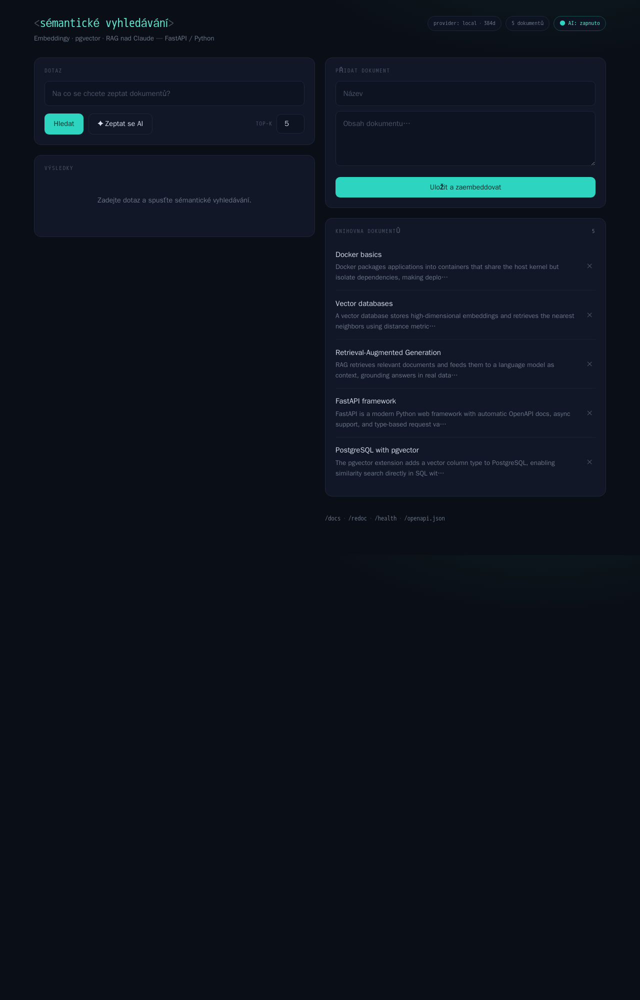
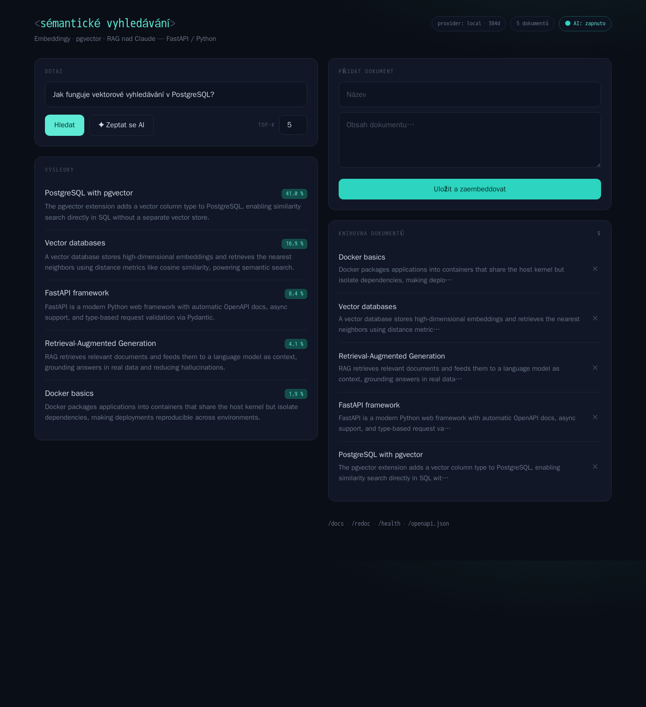
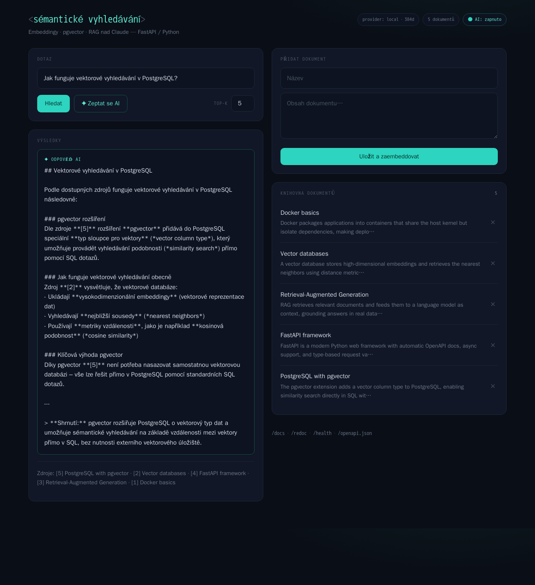

# Semantic Document Search (RAG demo)

Sémantické vyhledávání v dokumentech postavené na **vektorové databázi** a **RAG** pipeline s Claude. Celé běží v Dockeru a nastartuje jedním příkazem. Součástí je i jednoduché **webové UI** na `http://localhost:8000/`.

> 🎤 Chcete projekt **odprezentovat někomu bez technického zázemí** (nezná AI, Claude, RAG ani Python)? Hotový scénář prezentace najdete v [DEMO.md](DEMO.md).

## Co to ukazuje (talking points na pohovor)

- **RAG pipeline** — embedding dotazu → vektorové vyhledání nejbližších dokumentů → Claude odpoví *jen* z nalezeného kontextu (omezení halucinací).
- **Vektorová DB** — PostgreSQL + `pgvector`, cosine similarity, IVFFlat index. Žádný samostatný vektorový store.
- **Čistá architektura** — oddělené vrstvy: routery → služby (embeddings, RAG) → databáze. Provider embeddingů je za rozhraním, jde vyměnit (lokální model ↔ cloud) bez zásahu do zbytku.
- **Graceful degradation** — bez `ANTHROPIC_API_KEY` funguje jako čisté sémantické vyhledávání; klíč jen zapne generování odpovědí.
- **Production-ready detaily** — healthchecky, multi-stage závislosti, env config přes pydantic-settings, OpenAPI dokumentace zdarma, testy.

> Podrobný rozbor vrstev a designových rozhodnutí je v [ARCHITEKTURA.md](ARCHITEKTURA.md).

## 7 zajímavostí o projektu

1. **Žádný samostatný vektorový store.** Embeddingy i podobnostní vyhledávání běží přímo v PostgreSQL díky rozšíření `pgvector` — jedna databáze na data i vektory, cosine similarity přes `IVFFlat` index (`app/database.py`).

2. **Funguje i bez klíče k Claude.** Bez `ANTHROPIC_API_KEY` se `/api/ask` sám degraduje na čisté sémantické vyhledávání se stub odpovědí; klíč jen zapne generování. Není to bug, je to záměr (graceful degradation).

3. **Embedding dimenze (384) je zadrátovaná na třech místech, která musí souhlasit** — lokální model `all-MiniLM-L6-v2`, `settings.embedding_dim` a sloupec `Vector(...)`. Změna modelu znamená změnit dim *a* přegenerovat tabulku i index (smazat volume `pgdata`).

4. **Provider embeddingů je za rozhraním (ABC) + factory se singletonem.** `get_embedding_provider()` je `@lru_cache(maxsize=1)`, takže se model načte jen jednou. Zbytek aplikace nikdy neimportuje konkrétní provider — cloud provider (Voyage/OpenAI) je připravený jako rozšiřovací bod.

5. **Model se stahuje až při prvním použití — uvnitř kontejneru.** `sentence-transformers` si `all-MiniLM-L6-v2` (384-dim, žádné externí volání při inferenci) stáhne při prvním embeddingu, ne při buildu image.

6. **„Testy" nejsou izolované unit testy.** `tests/` volají *živý* stack přes HTTP na `localhost:8000` — je to spíš smoke/integration sada, která ověřuje reálné chování celé pipeline včetně databáze.

7. **Seeduje se chytře, ne slepě.** Při startu (`lifespan`) se 5 ukázkových dokumentů nahraje jen tehdy, když je tabulka prázdná — restart kontejneru tak data neduplikuje. RAG odpověď generuje `claude-sonnet-4-6` výhradně z nalezeného kontextu.

## Architektura

```
┌─────────┐   embed    ┌──────────────┐   retrieve   ┌──────────┐
│  Dotaz  │ ─────────▶ │  pgvector    │ ───────────▶ │  Claude  │
└─────────┘            │  (top-k)     │   + context  │  odpověď │
                       └──────────────┘              └──────────┘
```

## Spuštění

```bash
cp .env.example .env          # volitelně doplň ANTHROPIC_API_KEY
docker compose up --build
```

Při startu se naseeduje 5 ukázkových dokumentů. Pak je k dispozici:

- **Webové UI** — `http://localhost:8000/` (vyhledávání, dotaz na AI, správa dokumentů)
- **Interaktivní API dokumentace** — `http://localhost:8000/docs`

## Náhledy

Úvodní stránka — vyhledávání, RAG dotaz a správa dokumentů na jedné stránce:



Sémantické vyhledávání — výsledky seřazené podle skóre podobnosti:



RAG odpověď — Claude odpoví z nalezeného kontextu a uvede zdroje:



## Endpointy

| Metoda | Cesta | Popis |
|--------|-------|-------|
| `GET`  | `/` | Webové UI (jednostránková aplikace) |
| `POST` | `/api/documents` | Přidá a zaembedduje dokument |
| `GET`  | `/api/documents` | Seznam dokumentů (vč. obsahu) |
| `DELETE` | `/api/documents/{id}` | Smaže dokument |
| `GET`  | `/api/search?q=...` | Čisté sémantické vyhledávání se skóre |
| `POST` | `/api/ask` | RAG — vyhledá kontext a nechá Claude odpovědět |
| `GET`  | `/health` | Healthcheck |

## Příklady

```bash
# Sémantické vyhledávání
curl "http://localhost:8000/api/search?q=jak%20funguje%20izolace%20aplikaci&top_k=3"

# RAG odpověď (vyžaduje ANTHROPIC_API_KEY)
curl -X POST http://localhost:8000/api/ask \
  -H "Content-Type: application/json" \
  -d '{"query": "Co je RAG a proč omezuje halucinace?", "top_k": 3}'
```

## Testy

```bash
# se spuštěným stackem
pip install httpx pytest
pytest tests/
```

## Tech stack

Python 3.12 · FastAPI · SQLAlchemy 2.0 · PostgreSQL 16 + pgvector · sentence-transformers · Anthropic SDK · Docker Compose
